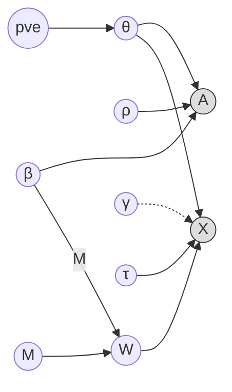

# Chickpea

Topic-Model-Based Peak-Gene Linking

## Features

- **Simulation** (`sim-link`): Simulate paired RNA + ATAC data with ground-truth peak-gene links
  - Shared topic model across ATAC and RNA modalities
  - Binary indicator matrix M mapping peaks to genes
  - Per-cell log-normal depth noise
  - Optional gene-topic effects for differential topic sensitivity
  - PVE-controlled topic proportions (following data-beans convention)
- **Inference** (planned): Jointly recover topic proportions and peak-gene linking probabilities from paired RNA + ATAC data

## Generative Model

### `sim-link`: Paired ATAC + RNA Simulation

The model generates multimodal single-cell data from a shared topic structure. ATAC peaks and RNA gene expression are linked through an indicator matrix $M_{gr}$ that maps peaks to target genes.

#### Shared parameters

$$\theta_{it} = \text{pve} \cdot \mathbb{1}[t = t_i^*] + \frac{1 - \text{pve}}{K - 1} \cdot \mathbb{1}[t \ne t_i^*], \quad t_i^* \sim \text{Uniform}\{1, \ldots, K\}$$

$$\beta_{tr} = \text{softmax}_r(\eta_{tr}), \quad \eta_{tr} \sim \mathcal{N}(0, 1)$$

where $\theta_{it}$ are topic proportions for cell $i$ and $\beta_{tr}$ is the shared ATAC dictionary for topic $t$ and peak $r$.

#### ATAC counts

$$A_{ir} \sim \text{Poisson}\!\left(\rho_i \sum_t \theta_{it}\, \beta_{tr}\right), \quad \ln \rho_i \sim \mathcal{N}(\ln d_A,\; \sigma_\rho^2)$$

where $d_A$ is the baseline ATAC depth and $\rho_i$ is per-cell depth noise.

#### RNA counts

$$X_{ig} \sim \text{Poisson}\!\left(\tau_i \sum_t \gamma_{gt}\, \theta_{it} \sum_r \beta_{tr}\, M_{gr}\right), \quad \ln \tau_i \sim \mathcal{N}(\ln d_X,\; \sigma_\tau^2)$$

where $M_{gr} \in \{0,1\}$ is the peak-gene indicator matrix, $\gamma_{gt} \sim \text{LogNormal}(0, \sigma_\gamma^2)$ are optional gene-topic effects, and $d_X$ is the baseline RNA depth.

The derived RNA dictionary is $W_{gt} = \sum_r M_{gr}\, \beta_{tr}$, giving the effective rate:

$$\text{rate}_{ig} = \tau_i \sum_t \gamma_{gt}\, \theta_{it}\, W_{gt}$$



- **Shaded nodes**: observed data ($A$ = ATAC, $X$ = RNA)
- **Dashed arrows**: optional gene-topic effects ($\gamma$, disabled when `--gene-topic-sd 0`)

## Usage

### Simulation

```bash
chickpea sim-link \
  --out ./results/sim \
  --n-genes 2000 \
  --n-peaks 10000 \
  --n-cells 5000 \
  --n-topics 10 \
  --linked-gene-fraction 0.3 \
  --n-causal-per-gene 3 \
  --depth-rna 5000 \
  --depth-atac 2000 \
  --pve-topic 0.8 \
  --gene-topic-sd 0.3 \
  --cell-sd-log-depth-atac 0.5 \
  --cell-sd-log-depth-rna 0.5 \
  --rseed 42
```

**Output files:**
- `sim.atac.zarr/` — Sparse ATAC count matrix (peaks x cells)
- `sim.rna.zarr/` — Sparse RNA count matrix (genes x cells)
- `sim.dict.parquet` — ATAC dictionary $\beta$ [peaks x topics]
- `sim.prop.parquet` — Topic proportions $\theta^\top$ [cells x topics]
- `sim.derived_dict.parquet` — Derived RNA dictionary $W$ [genes x topics]
- `sim.gamma.parquet` — Gene-topic effects $\gamma$ [genes x topics] (when `--gene-topic-sd > 0`)
- `sim.ground_truth.tsv.gz` — True peak-gene links (gene, peak)
- `sim.gene_names.txt` — Gene names
- `sim.peak_names.txt` — Peak names in `chr:start-end` format
- `sim.barcodes.txt` — Cell barcode names

**Backend options:** `--backend zarr` (default) or `--backend hdf5`

## Installation

```bash
cargo build --release -p chickpea
```
