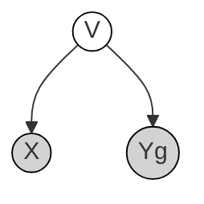
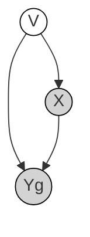
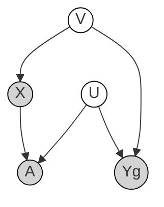
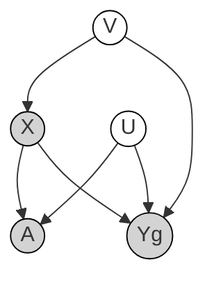

# COunterfactual COnfounder Adjustment

## Simulation DAGs

### `simulate-one` (single cell type)

No cell-type heterogeneity. Individual-level confounding only.

**Null (no direct X→Yg)**

**Causal (X→Yg present)**

| Edge | Model param | Sim. param | Description |
|------|-------------|------------|-------------|
| V → X | α | `pve_covar_exposure` | Confounder drives exposure assignment |
| X → Y | β | `pve_exposure_gene` | Causal effect of exposure on gene expression (causal genes only) |
| V → Y | γ | `pve_covar_gene` | Confounder directly affects gene expression |

Generative model:

- $V_i \sim \mathcal{N}(0, I)$ — individual confounders
- $X_i \sim \mathrm{Cat}(\mathrm{softmax}(V_i \alpha + \varepsilon))$ — exposure assignment
- $\log \mu_{ig} = \beta_g X_i + V_i \gamma_g + \varepsilon$ — log mean expression
- $Y_{ijg} \sim \mathrm{Poisson}(\rho_j \exp(\log \mu_{ig}))$ — cell-level counts

### `simulate-collider` (multiple cell types)

Cell-type assignment A is a collider on the V→X→Y path.
U is a cell-level confounder that affects both A and Y.

**Null (no direct X→Yg)**

**Causal (X→Yg present)**

| Edge | Model param | Sim. param | Description |
|------|-------------|------------|-------------|
| V → X | α | `pve_covar_exposure` | Individual confounder drives exposure |
| X → A | η | `pve_exposure_celltype` | Exposure shifts cell-type composition (collider) |
| U → A | δ | `pve_cell_covar_celltype` | Cell-level confounder drives cell-type assignment (collider) |
| X → Y | β | `pve_exposure_gene` | Causal exposure effect on expression (causal genes only) |
| V → Y | γ | `pve_covar_gene` | Individual confounder directly affects expression |
| U → Y | ξ | `pve_cell_covar_gene` | Cell-level confounder directly affects expression |

Generative model:

- $V_i \sim \mathcal{N}(0, I)$, $U_j \sim \mathcal{N}(0, I)$ — individual and cell-level confounders
- $X_i \sim \mathrm{Cat}(\mathrm{softmax}(V_i \alpha + \varepsilon))$
- $A_{ij} \sim \mathrm{Cat}(\mathrm{softmax}(U_j \delta + X_i \eta + \varepsilon))$
- $\log \mu_{ijg} = \Delta_{g,A} + \beta_g X_i + V_i \gamma_g + U_j \xi_g + \varepsilon$
- $Y_{ijg} \sim \mathrm{Poisson}(\rho_j \exp(\log \mu_{ijg}))$ — cell-level counts

### Collider bias

Conditioning on cell type A opens the path X → A ← U → Y:

- When X affects A (composition shift), and U also affects A,
  conditioning on A induces a spurious association between X and U.
- Since U → Y, this creates a non-causal path X ↔ U → Y,
  inflating the apparent effect of X on Y even for non-causal genes.

CoCoA addresses this by matching cells across exposure groups using KNN,
constructing counterfactual controls (y0) for each treated cell (y1).
The topic-weighted matching (`z_matched(k)`) ensures matches are within
the same cell type, but residual bias remains when composition shifts
alter the within-type cell-state distribution.

