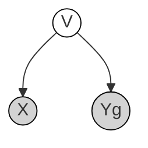
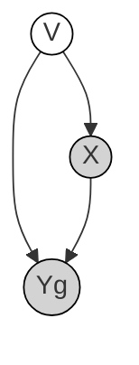
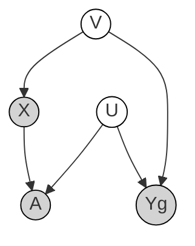
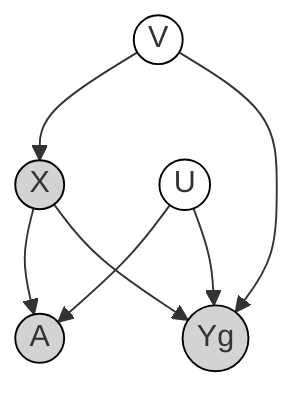

# COunterfactual COnfounder Adjustment

## Simulation DAGs

### `simulate-one` (single cell type)

No cell-type heterogeneity. Individual-level confounding only.

**Null (no direct X→Yg)**


```mermaid
graph TD
    V((V)) --> X((X))
    V((V)) --> Y_g((Yg))
    classDef open fill:#fff,stroke:#000
    classDef shaded fill:#d3d3d3,stroke:#000
    class V open
    class X,Y_g shaded
```

**Causal (X→Yg present)**


```mermaid
graph TD
    V((V)) --> X((X))
    V((V)) --> Y_g((Yg))
    X((X)) --> Y_g((Yg))
    classDef open fill:#fff,stroke:#000
    classDef shaded fill:#d3d3d3,stroke:#000
    class V open
    class X,Y_g shaded
```

| Edge | Model param | Sim. param | Description |
|------|-------------|------------|-------------|
| V → X | α | `pve_covar_exposure` | Confounder drives exposure assignment |
| X → Y | β | `pve_exposure_gene` | Causal effect of exposure on gene expression (causal genes only) |
| V → Y | γ | `pve_covar_gene` | Confounder directly affects gene expression |

Generative model:

- $V_i \sim \mathcal{N}(0, I)$ — individual confounders
- $X_i \sim \mathrm{Cat}(\mathrm{softmax}(V_i \alpha + \varepsilon))$ — exposure assignment
- $\log \mu_{ig} = \beta_g X_i + V_i \gamma_g + \varepsilon$ — log mean expression
- $Y_{ijg} \sim \mathrm{Poisson}(\rho_j \exp(\log \mu_{ig}))$ — cell-level counts

### `simulate-collider` (multiple cell types)

Cell-type assignment A is a collider on the V→X→Y path.
U is a cell-level confounder that affects both A and Y.

**Null (no direct X→Yg)**


```mermaid
graph TD
    V((V)) --> X((X))
    V((V)) --> Yg((Yg))
    X((X)) --> A((A))
    U((U)) --> A((A))
    U((U)) --> Yg((Yg))
    classDef open fill:#fff,stroke:#000
    classDef shaded fill:#d3d3d3,stroke:#000
    class V,U open
    class X,A,Yg shaded
```

**Causal (X→Yg present)**


```mermaid
graph TD
    V((V)) --> X((X))
    V((V)) --> Yg((Yg))
    X((X)) --> A((A))
    X((X)) --> Yg((Yg))
    U((U)) --> A((A))
    U((U)) --> Yg((Yg))
    classDef open fill:#fff,stroke:#000
    classDef shaded fill:#d3d3d3,stroke:#000
    class V,U open
    class X,A,Yg shaded
```

| Edge | Model param | Sim. param | Description |
|------|-------------|------------|-------------|
| V → X | α | `pve_covar_exposure` | Individual confounder drives exposure |
| X → A | η | `pve_exposure_celltype` | Exposure shifts cell-type composition (collider) |
| U → A | δ | `pve_cell_covar_celltype` | Cell-level confounder drives cell-type assignment (collider) |
| X → Y | β | `pve_exposure_gene` | Causal exposure effect on expression (causal genes only) |
| V → Y | γ | `pve_covar_gene` | Individual confounder directly affects expression |
| U → Y | ξ | `pve_cell_covar_gene` | Cell-level confounder directly affects expression |

Generative model:

- $V_i \sim \mathcal{N}(0, I)$, $U_j \sim \mathcal{N}(0, I)$ — individual and cell-level confounders
- $X_i \sim \mathrm{Cat}(\mathrm{softmax}(V_i \alpha + \varepsilon))$
- $A_{ij} \sim \mathrm{Cat}(\mathrm{softmax}(U_j \delta + X_i \eta + \varepsilon))$
- $\log \mu_{ijg} = \Delta_{g,A} + \beta_g X_i + V_i \gamma_g + U_j \xi_g + \varepsilon$
- $Y_{ijg} \sim \mathrm{Poisson}(\rho_j \exp(\log \mu_{ijg}))$ — cell-level counts

### Collider bias

Conditioning on cell type A opens the path X → A ← U → Y:

- When X affects A (composition shift), and U also affects A,
  conditioning on A induces a spurious association between X and U.
- Since U → Y, this creates a non-causal path X ↔ U → Y,
  inflating the apparent effect of X on Y even for non-causal genes.

## `diff` pipeline

Default order of operations in `cocoa diff`. Stage 1 (steps 1 to 5) works on cells; stage 2
(step 6) works on individuals and is where individual-level confounding is removed.

1. **Collider residualization** of topic weights.
   Per topic, the exposure-group mean of individual-level log proportions is compared with the grand mean,
   and every cell's proportion is multiplied by `exp(-(group_mean - grand_mean))`.
   This is a multiplicative rescale, so a zero stays zero: hard one-hot assignments (`-t`) are
   unchanged after row renormalization, and the tool warns. Use soft proportions (`-r`) for
   residualization to change the topic weights.
2. **Pseudobulks across individuals.**
   Cells are projected and centred per individual *within cell state*: the projection is fit as
   state(bin) + shift(individual) by alternating the bins with the individual shifts. The shift
   carries donor and exposure offsets, which must not split pseudobulks, but not the individual's
   cell-type composition, which a plain per-individual mean would also subtract. All cells are
   then binned together by the sign pattern of the leading coordinates, which forms a binary
   code tree over cell states; the finest level gives about two cells per individual per leaf.
   Exposure is not used, so pseudobulks mix exposures. `--adjustment-data-files` replaces the
   projection with one from separate data on the same cells. Pseudobulks always come from cell
   state: `--covariate-file` does not change them and enters stage 2 only.
3. **Mixing.** A leaf with fewer than `--min-individuals-per-pb` individuals (default 3)
   merges with its sibling into the parent node, bottom-up, for at most `--pb-merge-levels`
   levels (default 8). Per topic, a pseudobulk still below the minimum is dropped: it cannot
   separate its baseline μ from its individuals' multipliers. Kept and dropped counts per topic
   go to `{out}.stage1.parquet`, with a warning when more than a fifth of a topic's cells are
   dropped. (An earlier multilevel refine built pseudobulks within each individual; there the
   label-free baseline absorbed most of the exposure effect.)
   Sign bins can still pool several cell states, and when exposure shifts their mix, composition
   leaks into the effect. So cells then move between neighbouring pseudobulks (codes one bit
   apart) under a Poisson model with a pseudobulk rate and an individual offset, for ten sweeps,
   until each pseudobulk holds one cell state. The refinement is label-free and never leaves a
   pseudobulk with fewer than `--min-individuals-per-pb` individuals.
4. **Sufficient statistics.** Every cell's raw counts are summed per topic into its pseudobulk and
   its individual. No exposure labels are used, so stage 1 is computed once and shared by every
   permutation draw. (Earlier versions matched cells across exposures, first to build a
   counterfactual and then only to trim cells; the pseudobulk baseline makes both unnecessary.)
   There is no per-gene row scale (the NB-Fisher housekeeping weights of an earlier model): the
   baseline below is a count likelihood, and scaled counts would distort it.
5. **Stage-1 baseline** (per topic):

   ```text
   y1(g,i,p) ~ Poisson( n(i,p) · μ(g,p) · Λ(g,i) )
   ```

   a rank-1 fit with a free multiplier Λ per individual, by alternating closed-form updates
   (Gamma(a0, b0) pseudo-counts keep sparse genes finite). μ is per pseudobulk and shared by the
   individuals whose cells fall in it. This individual × pseudobulk design identifies μ from the
   observed counts alone (up to one scale per gene that cancels in every reported effect),
   provided pseudobulks mix individuals; the original CoCoA-diff kept μ per individual and needed
   an imputed counterfactual to identify it. It uses no exposure labels, so it is fit once. It
   supplies each individual's expected count at its own cell states, m(g,i) = Σ_p μ(g,p) n(i,p).
   (An earlier version fit τ, δ and a trended dispersion φ here, using the labels; stage 2 never
   used them, and the label dependence forced a refit in every permutation draw.)
6. **Stage 2: the exposure effect** (per topic, on individuals). With Λ_i = y1_i / m_i, the log
   effect ψ(x) = log τ(x) − log τ(0) of each exposure level against the reference is fit per gene
   by a Gamma GLM with a log link, E[Λ | V, X] = exp(b_0 + b_e' e(V) + ψ(X)), where e(V) are the
   propensities P(X = x | V) (Dukes & Vansteelandt 2018, eq. 6). Its score for ψ is a g-estimating
   equation and doubly robust: ψ is consistent if the propensity is right, whatever the outcome
   looks like, or if expression depends on V log-linearly through e(V). Individuals without overlap
   drop out on their own. Then τ(0) = mean_i Λ_i e^{−ψ(X_i)},
   τ(x) = τ(0) e^{ψ(x)}, and δ_i = Λ_i e^{−ψ(X_i)} / τ(0). Without confounders the model holds only
   the level indicators and ψ is the log ratio of means. See `docs/identification.md` for the
   definitions and the identifying assumptions.

Individual-level confounders V come from, in order: `--covariate-file` (measured covariates),
`--control-genes` (factors of genes that respond to V but not to the exposure, RUV-g), or, on
request, `--confounder-pcs auto|K` (top principal components of individual expression, assumed
to carry no exposure signal). Without any of them the effect is unadjusted for individual-level
confounding.

| Estimand | Shape | File |
|----------|-------|------|
| τ per exposure level and log effect per non-reference level | gene × topic | `*.effect.parquet` |
| δ, individual effect independent of exposure (mean 1) | gene × individual × topic | `*.delta.parquet` |
| `contrast` = log effect averaged over topics (`contrast_<level>` per level with more than two levels), `log_mean` = log mean count per cell; with confounders also `contrast_unadjusted`; with control genes `control` | gene | `*.contrast.parquet` |
| propensity P(X ∣ V) per individual (with confounders) | individual × group | `*.propensity.parquet` |
| pseudobulks kept and dropped, cells kept and dropped, median individuals per kept pseudobulk | topic | `*.stage1.parquet` |
| permutation `contrast`, `z_score`, `pvalue` per level, and with more than two levels `global_stat`, `global_pvalue` (with `--n-permutations`) | gene | `*.perm.parquet` |

Column names depend on the number of exposure levels K. Levels are the
exposure names sorted as strings, and the one that sorts first is the
reference (level 0): `0` before `1`, `control` before `treated`, but also
`10` before `2`. Rename exposures if a different reference is wanted.

| Column | K = 2 | K > 2, for each non-reference level `L` |
|--------|-------|------------------------------------------|
| τ per level (`*.effect.parquet`) | `tau_<level>` for both levels | `tau_<level>` for every level |
| log effect (`*.effect.parquet`) | `log_effect` | `log_effect_L` |
| contrast (`*.contrast.parquet`, `*.perm.parquet`) | `contrast` | `contrast_L` |
| unadjusted contrast (`*.contrast.parquet`) | `contrast_unadjusted` | `contrast_L_unadjusted` |
| permutation z and p (`*.perm.parquet`) | `z_score`, `pvalue` | `z_score_L`, `pvalue_L` |
| global test (`*.perm.parquet`) | none | `global_stat`, `global_pvalue` |

With two levels there is a single contrast, so its columns keep the plain
names.

### Genes left out

Some effects cannot be estimated, and reporting a number for them would
distort the p-values of the rest. They are flagged and left out (NA), at
some cost in power. The `flag` column (`*.effect.parquet` per gene and
topic, `*.contrast.parquet` and `*.perm.parquet` per gene) is empty for
tested genes and otherwise names the reason:

| Flag | Scope | Meaning |
|------|-------|---------|
| `no_counts` | gene, topic | no counts in the topic |
| `level_zero` | gene, topic | every individual of some exposure level has zero counts (the effect is unbounded) |
| `level_sparse` | topic | some level has fewer than 3 individuals with cells in the topic |
| `weak_overlap` | run | some exposure arm has a propensity effective sample size below 3 |
| `degenerate_null` | run | the permutation draws hold fewer than 20 distinct relabelings (or fewer than half the draws, when fewer than 40 are requested) |

A gene's contrast averages its unflagged topics only; with none left, the
gene takes the flag of its first topic and NA contrast and p-values. A
run-level flag leaves every gene out, since the design cannot support the
test. Flags are fixed from the observed data and applied the same way to
every permutation draw. The log counts the genes left out per reason.

Inference is by permutation only. `--n-permutations` relabels exposure over individuals and
recomputes the statistic each time: stage 1 (the sums and the baseline fit) uses no labels and is
computed once, and only stage 2 is refit under every relabeling; the reported z compares the
observed contrast with the mean and standard deviation of the relabeled contrasts. With
confounders, relabelings are drawn from the fitted propensity by a pairwise-swap sampler
(conditional permutation test; Berrett, Wang, Barber & Samworth 2020), which keeps each
individual's V and δ together and changes only the exposure. Without them, labels are shuffled
uniformly, which is exact only when exposure is independent of V. A closed-form standard error
from the negative-binomial Fisher information was tried earlier and dropped: with a handful of
individuals per arm and heavy between-individual heterogeneity it understated the null spread by
about half.

### Why δ is not divided out

With one library per donor, batch is the individual, and an individual-level fold cannot be told
apart from that donor's response to exposure by the data alone. δ, the exposure-free individual
effect, is what is left of Λ_i after stage 2; its spread between individuals is exactly what the
permutation null is built from. Dividing counts by a within-exposure δ before estimating the
effect would leave the average effect unchanged and delete that spread. An earlier version did
exactly that with δ held fixed across permutations; on a null simulation it called most genes
significant. A δ that is a genuine technical nuisance (a lane or site spanning both
exposures) belongs in the denominator as an offset, and needs a batch variable that is not the
individual.

### What the estimator adjusts for, and what it assumes

Cell-level: within a pseudobulk, exposed and control individuals' cells share one cell-state rate
μ, so each individual's rate Λ_i is taken relative to its own cell states, and the topic
residualization handles the composition shift exposure itself induces.

Individual-level: δ_i must be independent of exposure given V. Any individual-level deviation
correlated with exposure that V does not capture is indistinguishable from the exposure effect,
since each individual is observed under one exposure only. This is an intrinsic limitation, not
one of the estimator: it lands in τ. With few individuals the propensity is estimated from a
handful of labels and removes confounding only partly; the conditional permutation keeps the test
calibrated, but the leftover bias stays in the point estimate.

## Simulation harness

`simulate-one` can plant a per-gene baseline (`--gene-mean-sd`) and a Gamma individual effect whose
dispersion follows a trend in mean expression (`--indv-dispersion-trend A,B`,
`--indv-dispersion-sd S0`), for realistic between-individual heterogeneity. Both simulators write
the planted parts of each log rate (`{out}.planted_exposure.tsv.gz`,
`{out}.planted_confounding.tsv.gz`, and for `simulate-collider` the per-cell-type
`planted_collider_shift` and `planted_celltype_baseline`), so bias can be scored without
estimating the truth. `make sim-calibration` in this directory checks the permutation null rate on
a confounded null; it needs the release binary and R with the arrow package.
