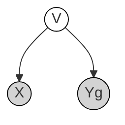
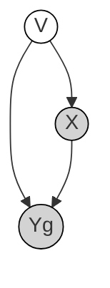
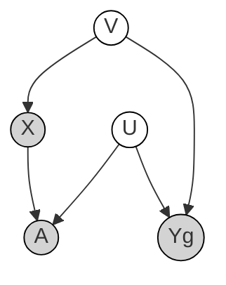
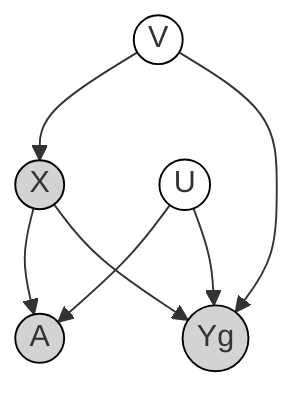

# COunterfactual COnfounder Adjustment

## Simulation DAGs

### `simulate-one` (single cell type)

No cell-type heterogeneity. Individual-level confounding only.

**Null (no direct X→Yg)**


```mermaid
graph TD
    V((V)) --> X((X))
    V((V)) --> Y_g((Yg))
    classDef open fill:#fff,stroke:#000
    classDef shaded fill:#d3d3d3,stroke:#000
    class V open
    class X,Y_g shaded
```

**Causal (X→Yg present)**


```mermaid
graph TD
    V((V)) --> X((X))
    V((V)) --> Y_g((Yg))
    X((X)) --> Y_g((Yg))
    classDef open fill:#fff,stroke:#000
    classDef shaded fill:#d3d3d3,stroke:#000
    class V open
    class X,Y_g shaded
```

| Edge | Model param | Sim. param | Description |
|------|-------------|------------|-------------|
| V → X | α | `pve_covar_exposure` | Confounder drives exposure assignment |
| X → Y | β | `pve_exposure_gene` | Causal effect of exposure on gene expression (causal genes only) |
| V → Y | γ | `pve_covar_gene` | Confounder directly affects gene expression |

Generative model:

- $V_i \sim \mathcal{N}(0, I)$ — individual confounders
- $X_i \sim \mathrm{Cat}(\mathrm{softmax}(V_i \alpha + \varepsilon))$ — exposure assignment
- $\log \mu_{ig} = \beta_g X_i + V_i \gamma_g + \varepsilon$ — log mean expression
- $Y_{ijg} \sim \mathrm{Poisson}(\rho_j \exp(\log \mu_{ig}))$ — cell-level counts

### `simulate-collider` (multiple cell types)

Cell-type assignment A is a collider on the V→X→Y path.
U is a cell-level confounder that affects both A and Y.

**Null (no direct X→Yg)**


```mermaid
graph TD
    V((V)) --> X((X))
    V((V)) --> Yg((Yg))
    X((X)) --> A((A))
    U((U)) --> A((A))
    U((U)) --> Yg((Yg))
    classDef open fill:#fff,stroke:#000
    classDef shaded fill:#d3d3d3,stroke:#000
    class V,U open
    class X,A,Yg shaded
```

**Causal (X→Yg present)**


```mermaid
graph TD
    V((V)) --> X((X))
    V((V)) --> Yg((Yg))
    X((X)) --> A((A))
    X((X)) --> Yg((Yg))
    U((U)) --> A((A))
    U((U)) --> Yg((Yg))
    classDef open fill:#fff,stroke:#000
    classDef shaded fill:#d3d3d3,stroke:#000
    class V,U open
    class X,A,Yg shaded
```

| Edge | Model param | Sim. param | Description |
|------|-------------|------------|-------------|
| V → X | α | `pve_covar_exposure` | Individual confounder drives exposure |
| X → A | η | `pve_exposure_celltype` | Exposure shifts cell-type composition (collider) |
| U → A | δ | `pve_cell_covar_celltype` | Cell-level confounder drives cell-type assignment (collider) |
| X → Y | β | `pve_exposure_gene` | Causal exposure effect on expression (causal genes only) |
| V → Y | γ | `pve_covar_gene` | Individual confounder directly affects expression |
| U → Y | ξ | `pve_cell_covar_gene` | Cell-level confounder directly affects expression |

Generative model:

- $V_i \sim \mathcal{N}(0, I)$, $U_j \sim \mathcal{N}(0, I)$ — individual and cell-level confounders
- $X_i \sim \mathrm{Cat}(\mathrm{softmax}(V_i \alpha + \varepsilon))$
- $A_{ij} \sim \mathrm{Cat}(\mathrm{softmax}(U_j \delta + X_i \eta + \varepsilon))$
- $\log \mu_{ijg} = \Delta_{g,A} + \beta_g X_i + V_i \gamma_g + U_j \xi_g + \varepsilon$
- $Y_{ijg} \sim \mathrm{Poisson}(\rho_j \exp(\log \mu_{ijg}))$ — cell-level counts

### Collider bias

Conditioning on cell type A opens the path X → A ← U → Y:

- When X affects A (composition shift), and U also affects A,
  conditioning on A induces a spurious association between X and U.
- Since U → Y, this creates a non-causal path X ↔ U → Y,
  inflating the apparent effect of X on Y even for non-causal genes.

## `diff` pipeline

Default order of operations in `cocoa diff`:

1. **Collider residualization** of topic weights.
   Per topic, the exposure-group mean of individual-level log proportions is compared with the grand mean,
   and every cell's proportion is multiplied by `exp(-(group_mean - grand_mean))`.
   This is a multiplicative rescale, so a zero stays zero: hard one-hot assignments (`-t`) are
   unchanged after row renormalization, and the tool warns. Use soft proportions (`-r`) for
   residualization to change matching weights.
2. **Multilevel pseudobulk refine.**
   Cells are hash-partitioned then DC-Poisson refined via senna's `collapse_columns_multilevel_vec`.
   Exposure is not used as multilevel strata, so pseudobulks may mix exposures. HNSW for CoCoA
   matching is built on the batch-centred projection. `--covariate-file` and
   `--adjustment-data-files` bypass refine.
3. **Optional pseudobulk δ export.** When refine runs, the finest-level batch fold (gene × individual)
   is written to `{out}.pb_delta.parquet` for QA, in the same melted layout senna uses for its
   `.delta.parquet`. It is not fed into τ.
4. **CoCoA matching.** Cross-exposure KNN matching builds y0 for each y1 cell on raw counts and
   accumulates the sufficient statistics per topic on raw counts. There is no per-gene row scale
   (the NB-Fisher housekeeping weights of the earlier model): the dispersion prior below handles
   per-gene variance, and scaled counts would count it twice and distort the count likelihood.
5. **Group model** (per topic):

   ```text
   y1(g,i,p) ~ Poisson( τ(g, x(i)) · δ(g,i) · μ(g,p) · n(i,p) )
   y0(g,p)   ~ Poisson( γ(g,p) · μ(g,p) · n(p) )
   δ(g,i)    ~ Gamma(φ_g, φ_g)
   ```

   τ is the average exposure effect, gene × exposure group. δ is the individual effect with the
   exposure effect removed: a random effect with mean 1 inside every group and between-individual
   dispersion 1/φ_g. μ is the shared cell-state rate and γ the matched residual, as in CoCoA.
   δ is integrated over, never divided out.

   φ_g follows a trend across genes, in the spirit of DESeq2 and edgeR's trended dispersion:
   - per gene, the Cox-Reid adjusted profile likelihood of φ over individuals is maximized (the
     adjustment corrects for the fitted group means); genes with fewer than three informative
     individuals or a maximum at the edge of the search bracket carry no evidence;
   - across all genes of a topic, log φ̂_g is regressed on log mean count per cell, weighted by the
     number of informative individuals;
   - every gene takes the trend value at its own mean. There is no per-gene posterior on top: the
     exposure contrast barely depends on φ (its null comes from permutation), a two-parameter trend
     cannot chase per-gene noise, and the individual effects δ are shrunk with a strength that
     tracks expression level.

   The fit runs in two passes over gene blocks: φ free in the first pass (yielding the evidence),
   the global trend, then a warm-started second pass with φ fixed at the trend. The
   permutation test repeats both passes under every relabeling, so the prior is re-estimated under
   the null.

| Estimand | Shape | File |
|----------|-------|------|
| τ, average exposure effect | gene × exposure group, per topic | `*.effect.parquet` |
| δ, individual effect without exposure | gene × individual, per topic | `*.delta.parquet` |
| `contrast` = log τ(group 1) − log τ(group 0), `dispersion` = φ from the trend | gene | `*.contrast.parquet` |
| permutation `contrast`, `z_score`, `pvalue` (with `--n-permutations`) | gene | `*.perm.parquet` |

Inference is by permutation only. `--n-permutations` shuffles exposure labels over individuals and
refits the whole group model each time, so every label-dependent quantity, including δ and φ, is
recomputed under the null; the reported z compares the observed contrast with the mean and standard
deviation of the permuted contrasts. A closed-form standard error from the negative-binomial Fisher
information was tried and dropped: with a handful of individuals per arm and heavy between-individual
heterogeneity it understated the null spread by about half, whereas the permutation matched it.

### Why δ is a random effect and not a divisor

With one library per donor, batch is the individual, and an individual-level fold cannot be told
apart from that donor's response to exposure by the data alone. The group model separates them by
definition: τ carries the group mean, δ carries the within-group deviation, and the within-group
mean-1 constraint on δ is what identifies the split. Dividing counts by a within-exposure δ before
fitting τ would leave the average effect unchanged and delete the between-individual spread that its
standard error is built from. An earlier version of this branch did exactly that with δ held fixed
across permutations; on a null simulation it called most genes significant. A δ that is a genuine
technical nuisance (a lane or site spanning both exposures) belongs in the denominator as an offset,
and needs a batch variable that is not the individual.

## Simulation harness

`simulate-one` can plant a per-gene baseline (`--gene-mean-sd`) and a Gamma individual effect whose
dispersion follows a trend in mean expression (`--indv-dispersion-trend A,B`,
`--indv-dispersion-sd S0`), writing the planted values to `{out}.dispersion.tsv.gz`. The `Makefile`
in this directory runs the two checks used to validate the dispersion prior: `make sim-recovery`
(recover the planted φ_g through the full pipeline) and `make sim-calibration` (permutation null
rate on a confounded null). Both need the release binary and R with the arrow package.
