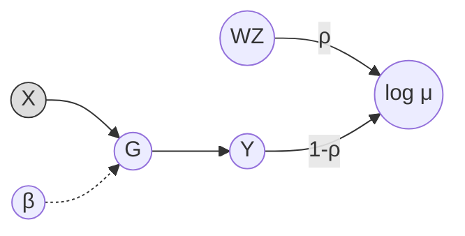
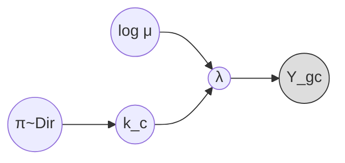
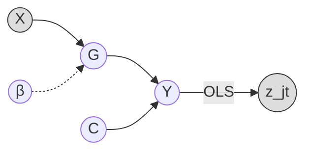

# Fagioli

Faceted Aggregation of Genotype Information On Locus Identification

## Features

- **eQTL Simulation** (`sim-qtl`): Simulate realistic single-cell eQTL data with cell type heterogeneity
  - Gene-by-gene cis-eQTL effects (TSS ± cis window)
  - Hybrid genetic architecture (shared + independent causal variants across cell types)
  - Factor model for gene-gene correlations (W × Z factorization)
  - Two-level variance decomposition (cell type identity vs individual genetic/noise)
  - Single-cell count generation with Poisson sampling
- **Summary Statistics Simulation** (`sim-sumstat`): Simulate multi-trait GWAS summary statistics with LD structure
  - Block-level causal architecture (shared + independent causal SNPs per LD block)
  - Optional low-rank confounders
  - Marginal OLS summary statistics and within-block LD scores
- **Fine-Mapping** (`map-sumstat`): Summary-statistics-based multi-trait fine-mapping
  - RSS likelihood with rSVD-compressed LD
  - SuSiE, BiSuSiE, and MultiLevel-SuSiE variational models
  - SGVB optimization with coordinate search over prior variance grid
- **Pseudobulk** (`pseudobulk`): Collapse single-cell counts into Poisson-Gamma pseudobulk profiles

## Generative Models

### `sim-qtl`: Single-cell eQTL

#### Phase 1: Individual-level expression

Per gene $g$, the model generates individual × cell type phenotypes in two stages:

**Stage A — Per-gene linear model** (N × K phenotypes):

$$Y_{gik} = \widetilde{G}_{gik} + \widetilde{\varepsilon}_{gik}, \quad \text{Var}(\widetilde{G}) = h^2, \quad \text{Var}(\widetilde{\varepsilon}) = 1 - h^2$$

where tildes denote standardized-then-scaled components. The genetic value (zero for non-eQTL genes) is:

$$G_{gik} = \sum_j X_{ij} \beta^{\text{sh}}_{gjk} + \sum_j X_{ij} \beta^{\text{ind}}_{gjk}$$

and $\varepsilon_{gik} \sim \mathcal{N}(0, 1)$.

**Stage B — Combine with factor model baseline**:

$$\log \mu_{gki} = \widetilde{M}_{gk} + Y_{gik}, \quad \text{Var}(\widetilde{M}) = \rho, \quad \text{Var}(Y) = 1 - \rho$$

where $\rho$ = `pve_cell_type` controls the fraction of log-rate variance from cell type identity vs individual phenotypes, and $M_{gk} = (W \times Z)_{gk}$ is the factor model baseline.



#### Phase 2: Single-cell sampling

Takes $\log \mu_{gki}$ from Phase 1 and samples single cells:



1. $n_i \sim \text{Poisson}(\mu)$ — number of cells per individual
2. $k_c \sim \text{Categorical}(\pi_i)$, where $\pi_i \sim \text{Dirichlet}(\alpha)$ — cell type assignment
3. $\lambda_{gc} = \exp(\log \mu_{g,k_c,i})$ scaled so $\sum_g \lambda_{gc} = \text{depth}$
4. $Y_{gc} \sim \text{Poisson}(\lambda_{gc})$

- **Shaded nodes**: observed ($Y$, $X$)
- **Dashed arrows**: independent eQTL effects (eQTL genes only)

### `sim-sumstat`: Multi-trait GWAS summary statistics

Generates multi-trait summary statistics from PLINK genotype files with block-structured LD.

#### Phenotype model

The genome is partitioned into LD blocks. Each block $b$ is causal with probability `causal_block_density`. Within each causal block, the genetic value for individual $i$ and trait $t$ is:

$$G_{it}^{(b)} = \sum_{j \in \mathcal{S}_b} X_{ij} \beta^{\text{sh}}_{jt} + \sum_{j \in \mathcal{I}_{bt}} X_{ij} \beta^{\text{ind}}_{jt}$$

where $\mathcal{S}_b$ are shared causal SNPs (same across traits) and $\mathcal{I}_{bt}$ are independent causal SNPs (different per trait). Effect sizes are scaled so that the total genetic variance across all causal blocks sums to $h^2$:

$$\beta^{\text{sh}}_{jt} \sim \mathcal{N}\!\left(0,\; \frac{\sigma^2_{\text{sh}}}{T \cdot S}\right), \quad \beta^{\text{ind}}_{jt} \sim \mathcal{N}\!\left(0,\; \frac{\sigma^2_{\text{ind}}}{I}\right)$$

with $\sigma^2_{\text{sh}} = h^2 \cdot S/(S+I)$ and $\sigma^2_{\text{ind}} = h^2 \cdot I/(S+I)$, divided equally across causal blocks.

The final phenotype combines genetic signal, optional low-rank confounders, and noise:

$$Y_t = \widetilde{G}_t + \widetilde{C \gamma_t} + \widetilde{\varepsilon}_t, \quad \text{Var}(\widetilde{G}) = h^2, \quad \text{Var}(\widetilde{C\gamma}) = \rho_c, \quad \text{Var}(\widetilde{\varepsilon}) = 1 - h^2 - \rho_c$$

where tildes denote standardized-then-scaled components, $C = \text{QR}(R_{N \times r}) \cdot \Lambda_{r \times L}$ is a low-rank confounder matrix, $\gamma_t \sim \mathcal{N}(0, 1/L)$, and $\varepsilon_t \sim \mathcal{N}(0,1)$.



#### Summary statistics

For each SNP $j$ and trait $t$, marginal OLS produces:

$$\hat\beta_{jt} = \frac{X_j^\top Y_t}{X_j^\top X_j}, \quad \text{SE}_{jt} = \frac{\sqrt{\text{RSS}/(n-2)}}{\sqrt{X_j^\top X_j}}, \quad z_{jt} = \frac{\hat\beta_{jt}}{\text{SE}_{jt}}$$

Within-block LD scores: $\ell_j = \sum_{k \in \text{block}} r^2_{jk}$.

## Installation

```bash
cargo build --release
```

## Usage

### eQTL Simulation

Generate single-cell eQTL data with realistic genetic architecture:

```bash
fagioli sim-qtl \
  --bed-prefix /path/to/genotypes \
  --chromosome 22 \
  --output ./results/sim \
  --num-genes 500 \
  --num-cell-types 5 \
  --num-factors 10 \
  --eqtl-gene-proportion 0.4 \
  --shared-eqtl-proportion 0.6 \
  --independent-eqtl-proportion 0.4 \
  --genetic-variance 0.4 \
  --pve-cell-type 0.5 \
  --mean-cells-per-individual 1000 \
  --depth-per-cell 5000 \
  --seed 42
```

Or use a GFF/GTF file for gene annotations:

```bash
fagioli sim-qtl \
  --bed-prefix /path/to/genotypes \
  --gff-file /path/to/genes.gtf \
  --chromosome 22 \
  --left-bound 20000000 \
  --right-bound 30000000 \
  --output ./results/sim
```

**Output files:**
- `sim.counts.zarr/` or `sim.counts.h5` — Sparse count matrix (genes × cells)
  - Row names: Gene IDs with symbols (e.g., `ENSG00000000001_GENE1`)
  - Column names: Cell IDs with individual (e.g., `cell_0@HG00096`)
- `sim.cells.tsv.gz` — Cell annotations (cell_id, individual_id, cell_type)
- `sim.cell_to_individual.tsv.gz` — Cell-to-individual mapping
- `sim.genes.tsv.gz` — Gene annotations (gene_id, chromosome, tss, strand)
- `sim.eqtl_effects.tsv.gz` — True causal eQTL effects per gene
- `sim.gene_loadings.parquet` — Factor model gene loadings (W)
- `sim.factor_celltype.parquet` — Factor-celltype scores (Z)
- `sim.cell_fractions.parquet` — Individual cell type fractions (Π)
- `sim.log_rates.cell_type_{k}.parquet` — Individual-level log-rates (N × G per cell type)
- `sim.parameters.json` — All simulation parameters

**Backend options:** `--backend zarr` (default) or `--backend hdf5`

### Summary Statistics Simulation

Simulate multi-trait GWAS summary statistics with LD block structure:

```bash
fagioli sim-sumstat \
  --bed-prefix /path/to/genotypes \
  --chromosome 22 \
  --output ./results/sim \
  --num-traits 10 \
  --num-shared-causal 5 \
  --num-independent-causal 3 \
  --genetic-variance 0.4 \
  --causal-block-density 0.3 \
  --num-confounders 10 \
  --num-hidden-factors 5 \
  --pve-confounders 0.1 \
  --seed 42
```

**Output files:**
- `sim.sumstats.bed.gz` — Beta, SE, z-scores, p-values per SNP-trait pair
- `sim.ld_scores.bed.gz` — Within-block LD scores
- `sim.ld_blocks.bed.gz` — LD block intervals (BED format)
- `sim.ground_truth.bed.gz` — True causal effect sizes
- `sim.confounders.tsv.gz` — Confounder matrix (if `--num-confounders > 0`)
- `sim.parameters.json` — All simulation parameters

LD blocks can be provided via `--ld-block-file` (BED format) or estimated from data using Nystrom + rSVD.

### Summary Statistics Fine-Mapping

Multi-trait fine-mapping from summary statistics with an LD reference panel:

```bash
fagioli map-sumstat \
  --sumstat-file ./results/sim.sumstats.bed.gz \
  --bed-prefix /path/to/genotypes \
  --chromosome 22 \
  --output ./results/map \
  --model susie \
  --num-components 10 \
  --max-rank 50 \
  --num-iterations 500 \
  --seed 42
```

Available models: `susie`, `bisusie`, `multilevel-susie`.

**Output files:**
- `map.results.bed.gz` — Per-SNP-trait PIPs, posterior effect mean/std, marginal z-scores
- `map.parameters.json` — All mapping parameters

### Pseudobulk Aggregation

Collapse single-cell counts into pseudobulk profiles using Poisson-Gamma model:

```bash
fagioli pseudobulk \
  --sc-backend-files /path/to/counts.zarr \
  --cell-annotations /path/to/cells.tsv.gz \
  --output ./results/pb
```

### General Usage

```bash
fagioli --help
```
