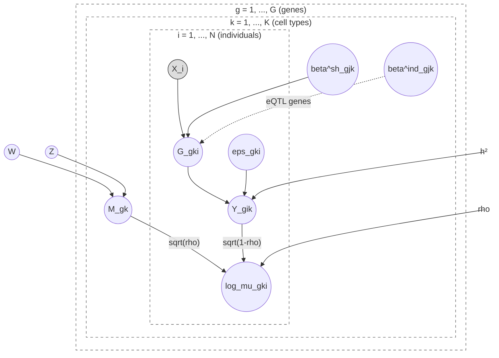
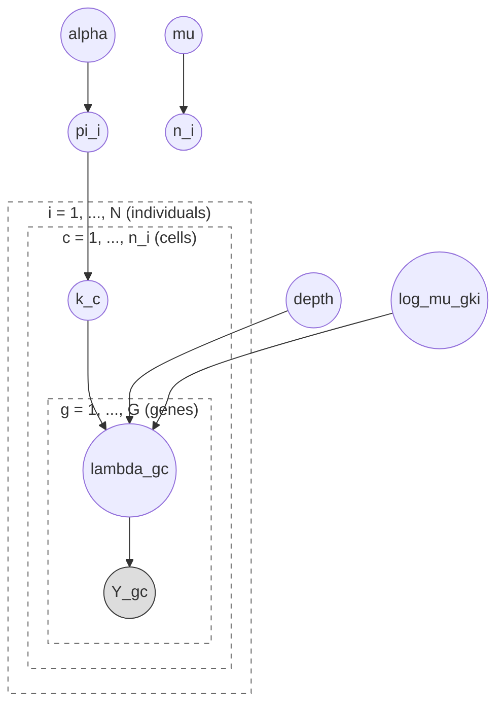

# Fagioli

Molecular QTL simulation toolkit for single-cell genomics

## Features

- **eQTL Simulation** (`sim-qtl`): Simulate realistic single-cell eQTL data with cell type heterogeneity
  - Gene-by-gene cis-eQTL effects (TSS ± cis window)
  - Hybrid genetic architecture (shared + independent causal variants across cell types)
  - Factor model for gene-gene correlations (W × Z factorization)
  - Two-level variance decomposition (cell type identity vs individual genetic/noise)
  - Single-cell count generation with Poisson sampling
- **Pseudobulk** (`pseudobulk`): Collapse single-cell counts into Poisson-Gamma pseudobulk profiles

## Generative Model

### Phase 1: Individual-level expression

Per gene $g$, the model generates individual × cell type phenotypes in two stages:

**Stage A — Per-gene linear model** (N × K phenotypes):

$$Y_{gik} = \sqrt{h^2} \cdot \widetilde{G}_{gik} + \sqrt{1-h^2} \cdot \widetilde{\varepsilon}_{gik}$$

where tildes denote column-standardized values, and:

- $G_{gik} = \sum_j X_{ij} \beta^{\text{sh}}_{gjk} + \sum_j X_{ij} \beta^{\text{ind}}_{gjk}$ (genetic value; zero for non-eQTL genes)
- $\varepsilon_{gik} \sim \mathcal{N}(0, 1)$

**Stage B — Combine with factor model baseline**:

$$\log \mu_{gki} = \sqrt{\rho} \cdot \widetilde{M}_{gk} + \sqrt{1 - \rho} \cdot Y_{gik}$$

where $\rho$ = `pve_cell_type` controls the fraction of log-rate variance from cell type identity vs individual phenotypes, and $M_{gk} = (W \times Z)_{gk}$ is the factor model baseline.



### Phase 2: Single-cell sampling

Takes $\log \mu_{gki}$ from Phase 1 and samples single cells:



1. $n_i \sim \text{Poisson}(\mu)$ — number of cells per individual
2. $k_c \sim \text{Categorical}(\pi_i)$, where $\pi_i \sim \text{Dirichlet}(\alpha)$ — cell type assignment
3. $\lambda_{gc} = \exp(\log \mu_{g,k_c,i})$ scaled so $\sum_g \lambda_{gc} = \text{depth}$
4. $Y_{gc} \sim \text{Poisson}(\lambda_{gc})$

- **Shaded nodes**: observed ($Y$, $X$)
- **Dashed arrows**: independent eQTL effects (eQTL genes only)

## Installation

```bash
cargo build --release
```

## Usage

### eQTL Simulation

Generate single-cell eQTL data with realistic genetic architecture:

```bash
fagioli sim-qtl \
  --bed-prefix /path/to/genotypes \
  --chromosome 22 \
  --output ./results/sim \
  --num-genes 500 \
  --num-cell-types 5 \
  --num-factors 10 \
  --eqtl-gene-proportion 0.4 \
  --shared-eqtl-proportion 0.6 \
  --independent-eqtl-proportion 0.4 \
  --genetic-variance 0.4 \
  --pve-cell-type 0.5 \
  --mean-cells-per-individual 1000 \
  --depth-per-cell 5000 \
  --seed 42
```

Or use a GFF/GTF file for gene annotations:

```bash
fagioli sim-qtl \
  --bed-prefix /path/to/genotypes \
  --gff-file /path/to/genes.gtf \
  --chromosome 22 \
  --left-bound 20000000 \
  --right-bound 30000000 \
  --output ./results/sim
```

**Output files:**
- `sim.counts.zarr/` or `sim.counts.h5` — Sparse count matrix (genes × cells)
  - Row names: Gene IDs with symbols (e.g., `ENSG00000000001_GENE1`)
  - Column names: Cell IDs with individual (e.g., `cell_0@HG00096`)
- `sim.cells.tsv.gz` — Cell annotations (cell_id, individual_id, cell_type)
- `sim.cell_to_individual.tsv.gz` — Cell-to-individual mapping
- `sim.genes.tsv.gz` — Gene annotations (gene_id, chromosome, tss, strand)
- `sim.eqtl_effects.tsv.gz` — True causal eQTL effects per gene
- `sim.gene_loadings.parquet` — Factor model gene loadings (W)
- `sim.factor_celltype.parquet` — Factor-celltype scores (Z)
- `sim.cell_fractions.parquet` — Individual cell type fractions (Π)
- `sim.log_rates.cell_type_{k}.parquet` — Individual-level log-rates (N × G per cell type)
- `sim.parameters.json` — All simulation parameters

**Backend options:** `--backend zarr` (default) or `--backend hdf5`

### Pseudobulk Aggregation

Collapse single-cell counts into pseudobulk profiles using Poisson-Gamma model:

```bash
fagioli pseudobulk \
  --sc-backend-files /path/to/counts.zarr \
  --cell-annotations /path/to/cells.tsv.gz \
  --output ./results/pb
```

### General Usage

```bash
fagioli --help
```
