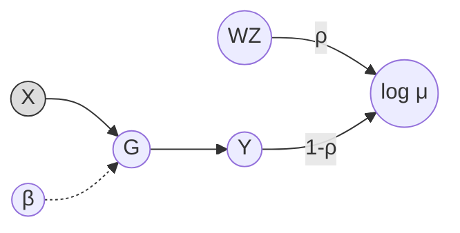
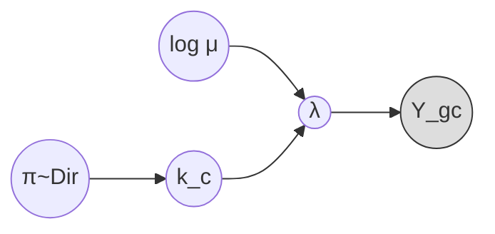
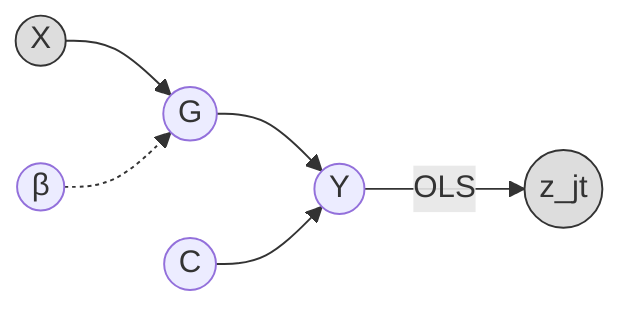

# Fagioli

Faceted Associations of Genotype Information via Omics-based Locus Identification

## Subcommands

### Simulation

- **`sim-geno`** — Wright-Fisher forward simulation of genotypes → PLINK BED
- **`sim-qtl`** — single-cell eQTL data with cell type heterogeneity
  - Gene-by-gene cis-eQTL effects (TSS ± cis window)
  - Hybrid genetic architecture (shared + independent causal variants across cell types)
  - Factor model for gene-gene correlations (W × Z factorization)
  - Two-level variance decomposition (cell type identity vs individual genetic/noise)
  - Single-cell count generation with Poisson sampling
- **`sim-sumstat`** — multi-trait GWAS summary statistics with LD structure
  - Block-level causal architecture (shared + independent causal SNPs per LD block)
  - Correlated genetic architecture via `--num-genetic-factors` — **required for a
    nonzero genetic correlation**; see the caveat below
  - Sparse and polygenic (infinitesimal) heritability components
  - Optional low-rank confounders
  - Marginal OLS summary statistics and within-block LD scores
- **`sim-mediation`** — SNP → expression → phenotype with confounders
  - Cis-eQTL effects on mediator genes, mediated and direct pheno
  - Supports collider bias and winner's-curse scenarios

### Fine-mapping and regression

- **`fit-sumstat-sgvb`** — multi-trait fine-mapping from GWAS z-scores
  - RSS likelihood with rSVD-compressed LD (Zhu & Stephens 2017 eigenspace approach)
  - `--model susie | bisusie | spike-slab`
  - `--prior-type single | ash` (ash turns the `--prior-var` grid into a learnable mixture)
  - Adaptive prior variance grid from LDSC h² estimation
  - Local LDSC intercept correction and PVE adjustment
  - Optional `--refine` for joint refinement of high-PIP variants across blocks
- **`fit-sumstat-mcmc`** — same RSS likelihood, sampled by elliptical slice sampling
- **`fit-qtl-sgvb`** — cis-eQTL fine-mapping with cell type heterogeneity
  - Poisson-Gamma pseudobulk aggregation per (individual, cell type) pair
  - Weighted Gaussian likelihood with per-observation variance
  - Cross-gene empirical Bayes prior-variance reweighting (`--empirical-bayes`)
- **`fit-prs-susie`** — ridge PRS from z-scores, then SuSiE fine-mapping on the predicted
  phenotypes; `--method cavi` (classical IBSS) or `--method sgvb`
- **`fit-regression`** — generic SGVB regression, `--model gaussian|poisson|nb` ×
  `--prior gaussian|susie` (aliased as `regression`)

- **`embed-eqtl`** — embed eQTL summary statistics as a variant × gene × context hyperedge
  - `score(variant, gene, context) = Σ_h u_h v_h c_h`; a cell type is a gate over programs
  - `ubiquitous` and `empty` are fixed values of the gate, not special cases in the code
  - Contrastive objective; a negative corrupts one slot of the hyperedge
  - Cells never powered to see the effect are sampled in neither class

### Utility

- **`pseudobulk`** — collapse single-cell counts into Poisson-Gamma pseudobulk profiles

## Generative Models

### `sim-qtl`: Single-cell eQTL

#### Phase 1: Individual-level expression

Per gene $g$, the model generates individual × cell type phenotypes in two stages:

**Stage A — Per-gene linear model** (N × K phenotypes):

$$Y_{gik} = \widetilde{G}_{gik} + \widetilde{\varepsilon}_{gik}, \quad \text{Var}(\widetilde{G}) = h^2, \quad \text{Var}(\widetilde{\varepsilon}) = 1 - h^2$$

where tildes denote standardized-then-scaled components. The genetic value (zero for non-eQTL genes) is:

$$G_{gik} = \sum_j X_{ij} \beta^{\text{sh}}_{gjk} + \sum_j X_{ij} \beta^{\text{ind}}_{gjk}$$

and $\varepsilon_{gik} \sim \mathcal{N}(0, 1)$.

**Stage B — Combine with factor model baseline**:

$$\log \mu_{gki} = \widetilde{M}_{gk} + Y_{gik}, \quad \text{Var}(\widetilde{M}) = \rho, \quad \text{Var}(Y) = 1 - \rho$$

where $\rho$ = `pve_cell_type` controls the fraction of log-rate variance from cell type identity vs individual phenotypes, and $M_{gk} = (W \times Z)_{gk}$ is the factor model baseline.


```mermaid
graph LR
    X(("X")) --> G(("G"))
    beta(("β")) -.-> G
    G --> Y(("Y"))
    M(("WZ")) -->|"ρ"| log_mu(("log μ"))
    Y -->|"1-ρ"| log_mu
    style X fill:#ddd,stroke:#333
```

#### Phase 2: Single-cell sampling

Takes $\log \mu_{gki}$ from Phase 1 and samples single cells:


```mermaid
graph LR
    log_mu(("log μ")) --> λ(("λ"))
    π(("π~Dir")) --> k(("k_c"))
    k --> λ
    λ --> Y(("Y_gc"))
    style Y fill:#ddd,stroke:#333
```

1. $n_i \sim \text{Poisson}(\mu)$ — number of cells per individual
2. $k_c \sim \text{Categorical}(\pi_i)$, where $\pi_i \sim \text{Dirichlet}(\alpha)$ — cell type assignment
3. $\lambda_{gc} = \exp(\log \mu_{g,k_c,i})$ scaled so $\sum_g \lambda_{gc} = \text{depth}$
4. $Y_{gc} \sim \text{Poisson}(\lambda_{gc})$

- **Shaded nodes**: observed ($Y$, $X$)
- **Dashed arrows**: independent eQTL effects (eQTL genes only)

### `sim-sumstat`: Multi-trait GWAS summary statistics

Generates multi-trait summary statistics from PLINK genotype files with block-structured LD.

#### Phenotype model

The genome is partitioned into LD blocks, of which `--num-causal-blocks` are drawn to carry causal SNPs. Within each causal block, the genetic value for individual $i$ and trait $t$ is:

$$G_{it}^{(b)} = \sum_{j \in \mathcal{S}_b} X_{ij} \beta^{\text{sh}}_{jt} + \sum_{j \in \mathcal{I}_{bt}} X_{ij} \beta^{\text{ind}}_{jt}$$

where $\mathcal{S}_b$ are shared causal SNPs (same across traits) and $\mathcal{I}_{bt}$ are independent causal SNPs (different per trait). Effect sizes are scaled so that the total genetic variance across all causal blocks sums to $h^2$ = `--h2-sparse`:

$$\beta^{\text{sh}}_{jt} \sim \mathcal{N}\!\left(0,\; \frac{\sigma^2_{\text{sh}}}{T \cdot S}\right), \quad \beta^{\text{ind}}_{jt} \sim \mathcal{N}\!\left(0,\; \frac{\sigma^2_{\text{ind}}}{I}\right)$$

with $\sigma^2_{\text{sh}} = h^2 \cdot S/(S+I)$ and $\sigma^2_{\text{ind}} = h^2 \cdot I/(S+I)$, divided equally across causal blocks.

The final phenotype combines genetic signal, optional low-rank confounders, and noise:

$$Y_t = \widetilde{G}_t + \widetilde{C \gamma_t} + \widetilde{\varepsilon}_t, \quad \text{Var}(\widetilde{G}) = h^2, \quad \text{Var}(\widetilde{C\gamma}) = \rho_c, \quad \text{Var}(\widetilde{\varepsilon}) = 1 - h^2 - \rho_c$$

where tildes denote standardized-then-scaled components, $C = \text{QR}(R_{N \times r}) \cdot \Lambda_{r \times L}$ is a low-rank confounder matrix, $\gamma_t \sim \mathcal{N}(0, 1/L)$, and $\varepsilon_t \sim \mathcal{N}(0,1)$.

A separate polygenic component (`--h2-polygenic`) puts dense infinitesimal effects on all SNPs; when present, the sparse and polygenic genetic values are standardized independently so each contributes its specified PVE.

#### Genetic correlation between traits

By default $\beta^{\text{sh}}_{jt}$ is drawn **independently for each trait** at the shared causal
variants. Traits then share causal *loci* but not effect sizes, so
$\mathbb{E}[\text{Cov}_g(t,t')] = 0$ and **the genetic correlation is zero**. That is fine for
testing per-trait fine-mapping, but it cannot exercise any method that depends on traits being
genetically related.

`--num-genetic-factors H` replaces the shared component with a factor model,
$\beta^{\text{sh}}_j = \Lambda f_j$ for a genome-wide $\Lambda_{T \times H}$, giving

$$\text{Cov}_g = \Lambda \Big(\textstyle\sum_j f_j f_j^\top\Big) \Lambda^\top$$

$\Lambda$ is drawn once and reused across blocks — a genetic factor is a property of the traits,
not of a locus, and per-block loadings would largely cancel when summed genome-wide. `H = 1` gives
a single shared axis ($|r_g| \to 1$); `H < T` gives low-rank pleiotropy. Independent causal
variants sit at distinct SNPs per trait and so add only to the diagonal, which dilutes $r_g$
without removing it.

The realised covariance is written to `{prefix}.genetic_covariance.tsv.gz` so downstream estimates
can be checked against it. Measured on 600 individuals × 1500 SNPs, 8 traits, 15 shared causal
variants per block: mean $|r_g|$ is **0.78** at `--num-genetic-factors 2` and **0.09** by default.


```mermaid
graph LR
    X(("X")) --> G(("G"))
    β(("β")) -.-> G
    G --> Y(("Y"))
    C(("C")) --> Y
    Y -->|"OLS"| z(("z_jt"))
    style X fill:#ddd,stroke:#333
    style z fill:#ddd,stroke:#333
```

#### Summary statistics

For each SNP $j$ and trait $t$, marginal OLS produces:

$$\hat\beta_{jt} = \frac{X_j^\top Y_t}{X_j^\top X_j}, \quad \text{SE}_{jt} = \frac{\sqrt{\text{RSS}/(n-2)}}{\sqrt{X_j^\top X_j}}, \quad z_{jt} = \frac{\hat\beta_{jt}}{\text{SE}_{jt}}$$

Within-block LD scores: $\ell_j = \sum_{k \in \text{block}} r^2_{jk}$.

### `fit-sumstat-*`: RSS eigenspace

Both summary-statistic fitters start from the RSS likelihood (Zhu & Stephens 2017):

$$z \sim \mathcal{N}(R\beta,\; R), \qquad R = X^\top X / n$$

$R$ is never formed. Instead $X/\sqrt{n} = UDV^\top$ gives $R = VD^2V^\top$, and the model is
solved in the $K$-dimensional eigenspace:

$$\tilde{y} = \tilde{D}^{-1}V^\top z, \qquad \tilde{X} = \tilde{D}V^\top, \qquad \tilde{D} = \sqrt{D^2 + \lambda}$$

which is a fixed-variance Gaussian regression in $K$-space. `fit-sumstat-sgvb` optimizes it with
SGVB; `fit-sumstat-mcmc` samples it with elliptical slice sampling.

## Installation

```bash
cargo build --release
```

## Usage

### Genotype Simulation

```bash
fagioli sim-geno \
  --num-individuals 2000 \
  --num-snps 10000 \
  --chromosome 22 \
  --ne 10000 \
  --num-generations 1000 \
  --output ./results/geno
```

**Output files:** `geno.bed`, `geno.bim`, `geno.fam`

### eQTL Simulation

```bash
fagioli sim-qtl \
  --bed-prefix /path/to/genotypes \
  --chromosome 22 \
  --output ./results/sim \
  --num-genes 500 \
  --num-cell-types 5 \
  --num-factors 10 \
  --eqtl-gene-proportion 0.4 \
  --shared-eqtl-proportion 0.6 \
  --independent-eqtl-proportion 0.4 \
  --genetic-variance 0.4 \
  --pve-cell-type 0.5 \
  --mean-cells-per-individual 1000 \
  --depth-per-cell 5000 \
  --seed 42
```

Or use a GFF/GTF file for gene annotations:

```bash
fagioli sim-qtl \
  --bed-prefix /path/to/genotypes \
  --gff-file /path/to/genes.gtf \
  --chromosome 22 \
  --left-bound 20000000 \
  --right-bound 30000000 \
  --output ./results/sim
```

**Output files:**
- `sim.counts.zarr/` or `sim.counts.h5` — Sparse count matrix (genes × cells)
  - Row names: Gene IDs with symbols (e.g., `ENSG00000000001_GENE1`)
  - Column names: Cell IDs with individual (e.g., `cell_0@HG00096`)
- `sim.cells.tsv.gz` — Cell annotations (cell_id, individual_id, cell_type)
- `sim.cell_to_individual.tsv.gz` — Cell-to-individual mapping
- `sim.genes.tsv.gz` — Gene annotations (gene_id, chromosome, tss, strand)
- `sim.eqtl_effects.tsv.gz` — True causal eQTL effects per gene
- `sim.gene_loadings.parquet` — Factor model gene loadings (W)
- `sim.factor_celltype.parquet` — Factor-celltype scores (Z)
- `sim.cell_fractions.parquet` — Individual cell type fractions (Π)
- `sim.log_rates.cell_type_{k}.parquet` — Individual-level log-rates (N × G per cell type)
- `sim.parameters.json` — All simulation parameters

**Backend options:** `--backend zarr` (default) or `--backend hdf5`

### Summary Statistics Simulation

```bash
fagioli sim-sumstat \
  --bed-prefix /path/to/genotypes \
  --chromosome 22 \
  --output ./results/sim \
  --num-traits 10 \
  --num-shared-causal 5 \
  --num-independent-causal 3 \
  --num-genetic-factors 2 \
  --h2-sparse 0.4 \
  --h2-polygenic 0.1 \
  --num-causal-blocks 5 \
  --num-confounders 10 \
  --num-hidden-factors 5 \
  --pve-confounders 0.1 \
  --seed 42
```

**Output files:**
- `sim.sumstats.bed.gz` — Beta, SE, z-scores, p-values per SNP-trait pair
- `sim.ld_scores.bed.gz` — Within-block LD scores
- `sim.ld_blocks.bed.gz` — LD block intervals (BED format)
- `sim.ground_truth.bed.gz` — True causal effect sizes
- `sim.genetic_covariance.tsv.gz` — Realised genetic covariance between traits (T×T)
- `sim.confounders.tsv.gz` — Confounder matrix (if `--num-confounders > 0`)
- `sim.parameters.json` — All simulation parameters

LD blocks can be provided via `--ld-block-file` (BED format) or estimated from data using Nystrom + rSVD.

### Mediation Simulation

```bash
fagioli sim-mediation \
  --bed-prefix /path/to/genotypes \
  --chromosome 22 \
  --output ./results/med \
  --num-genes 200 \
  --num-mediator-genes 20 \
  --num-observed-mediators 10 \
  --n-eqtl-per-gene 2 \
  --h2-eqtl 0.3 \
  --h2-mediated 0.2 \
  --seed 42
```

**Output files:**
- `med.gwas.sumstats.bed.gz` — GWAS summary statistics
- `med.eqtl.sumstats.bed.gz` — cis-eQTL summary statistics
- `med.eqtl.discovery.sumstats.bed.gz`, `med.eqtl.replication.sumstats.bed.gz` — split-sample
  eQTL statistics, for winner's-curse scenarios
- `med.ld_scores.bed.gz`, `med.ld_blocks.bed.gz` — LD structure
- `med.ground_truth.bed.gz` — True causal effects
- `med.genes.bed.gz` — Gene annotations with mediator status
- `med.confounders.tsv.gz` — Confounder matrix
- `med.parameters.json` — All simulation parameters

### Summary Statistics Fine-Mapping

Multi-trait fine-mapping from summary statistics with an LD reference panel:

```bash
fagioli fit-sumstat-sgvb \
  --sumstat-file ./results/sim.sumstats.bed.gz \
  --bed-prefix /path/to/genotypes \
  --chromosome 22 \
  --output ./results/map \
  --model susie \
  --num-components 10 \
  --max-rank 50 \
  --num-iterations 500 \
  --seed 42
```

With the ash mixture prior and cross-block refinement:

```bash
fagioli fit-sumstat-sgvb \
  --sumstat-file ./results/sim.sumstats.bed.gz \
  --bed-prefix /path/to/genotypes \
  --chromosome 22 \
  --output ./results/map_ash \
  --model susie \
  --prior-type ash \
  --refine \
  --num-iterations 500
```

Available models: `susie`, `bisusie`, `spike-slab`.

The MCMC counterpart takes the same input and produces the same outputs:

```bash
fagioli fit-sumstat-mcmc \
  --sumstat-file ./results/sim.sumstats.bed.gz \
  --bed-prefix /path/to/genotypes \
  --chromosome 22 \
  --output ./results/mcmc \
  --num-components 10
```

**Output files:**
- `map.results.bed.gz` — Per-SNP-trait PIPs, posterior effect mean/std, marginal z-scores
- `map.parameters.json` — All mapping parameters

### eQTL Fine-Mapping from Single-Cell Data

```bash
fagioli fit-qtl-sgvb \
  --sc-backend-files /path/to/counts.zarr \
  --cell-annotations /path/to/cells.tsv.gz \
  --bed-prefix /path/to/genotypes \
  --chromosome 22 \
  --gtf-file /path/to/genes.gtf \
  --output ./results/qtl \
  --model susie \
  --num-components 10 \
  --seed 42
```

**Output files:**
- `qtl.results.bed.gz` — Per-SNP-trait PIPs, posterior effect mean/std, marginal z-scores
- `qtl.gene_summary.tsv.gz` — Per-gene summary (best ELBO, top PIP SNPs)
- `qtl.parameters.json` — All mapping parameters

### PRS + SuSiE

Builds a ridge polygenic score from z-scores, then fine-maps on the predicted phenotypes:

```bash
fagioli fit-prs-susie \
  --sumstat-file ./results/sim.sumstats.bed.gz \
  --bed-prefix /path/to/genotypes \
  --chromosome 22 \
  --output ./results/prs \
  --ridge-lambda 0.1 \
  --method cavi \
  --num-components 10
```

**Output files:** `prs.results.bed.gz`, `prs.parameters.json`

### Generic Regression

```bash
fagioli fit-regression \
  -x design.parquet \
  -y outcome.parquet \
  --model gaussian \
  --prior susie \
  --iters 1000 \
  --output ./results/reg
```

**Output files:** `reg.mean.parquet`, `reg.var.parquet`, and `reg.disp.parquet` for the
negative-binomial likelihood.

### eQTL Embedding

```bash
fagioli embed-eqtl \
  --qtl-files ./qtl/block_*.tsv.gz \
  --output ./results/emb \
  --top-k 5 \
  --detect-z 4.0 \
  --embedding-dim 8 \
  --num-iterations 4000
```

**Output files:**
- `emb.variant_embedding.parquet` — variant loadings `u` (one row per variant)
- `emb.gene_embedding.parquet` — gene loadings `v` (one row per gene)
- `emb.context_embedding.parquet` — context gates `c`, including `ubiquitous`
- `emb.specificity.tsv.gz` — anchor, per-context scores, ubiquity index
- `emb.parameters.json` — all settings, the state census, the fit diagnostics

Every cell is classified as an **edge** (`|β|/se ≥ --detect-z`), **certified
absent** (undetected, but powered to see the pair's reference effect), or
**unknown** — and unknown cells are sampled in neither class. That rule is what
keeps statistical power out of the learned geometry, so a variant tested only
in the abundant cell types does not read as cell-type-specific.

Run `--shuffle-control` for a reference: with the labels shuffled the held-out
AUC must fall to about one half and the gate's effective rank must rise toward
`--embedding-dim`.

### Pseudobulk Aggregation

```bash
fagioli pseudobulk \
  --sc-backend-files /path/to/counts.zarr \
  --cell-annotations /path/to/cells.tsv.gz \
  --output ./results/pb
```

### General Usage

```bash
fagioli --help
```
