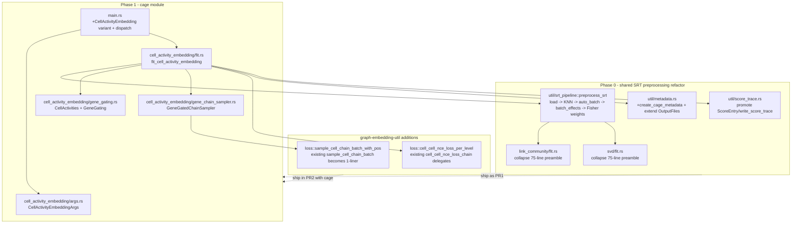

# pinto `cage` — activity-gated cell-graph embedding

## Context

Add a third pinto subcommand, `cage` (`cell-graph-embedding`), that learns
per-cell embeddings on the spatial cell-cell graph by "visiting each
gene": every gene defines a per-cell activity vector that gates a shared
multi-scale cell-cell hierarchy, and contrastive (NCE) updates are summed
over a small per-gene per-level learnable gate `α[g, ℓ]`. Embedding-only
— no count decoder, no VAE, no amortized encoder. The conceptual delta
over `pinto lc` and the existing `graph-embedding-util` chain trainer is
that gates and per-gene gating are exposed as first-class, learnable,
per-spatial-scale parameters.

Verified-feasible because most machinery already exists in workspace:
- shared coarsening (`pinto/src/util/graph_coarsen.rs:591`
  `graph_coarsen_multilevel`),
- chain-aware sampler + NCE (`graph-embedding-util/src/loss.rs:920`
  `build_per_batch_cell_samplers`, `:1105` `sample_cell_chain_batch`,
  `:1203` `cell_cell_nce_loss_chain`),
- embedding tables (`graph-embedding-util/src/model.rs:48`
  `JointEmbedModel`, `:63` `new_with_init`),
- Fisher-info gene weights (`data-beans-alg/src/gene_weighting.rs:53`
  `compute_nb_fisher_weights`),
- spatial KNN, parquet I/O, metadata.

What is genuinely new: per-gene activity precomputation, per-gene
per-level learnable gates `α[G, L]`, a thin sampler wrapper that
gene-gates the *positive* edge draw while reusing the existing
chain-aware sibling-negatives, and a per-level variant of the chain loss
so gates participate in autograd.

## Diagram



---

## Phase 0 — Shared SRT preprocessing refactor (PR 1)

`lc/fit.rs:51-235` and `svd/fit.rs:115-213` contain near-identical 75-line
preambles (load → invariants → spatial-or-expression KNN → optional
`auto_batch` → `estimate_and_write_batch_effects`). Extract once before
adding cage.

### `pinto/src/util/srt_pipeline.rs` (NEW)

Important constraint: `SrtCellPairs<'a>` borrows `&'a SparseIoVec` and
`&'a Mat` (`pinto/src/util/cell_pairs.rs:11`). The bundle therefore
**cannot** own both the data/coords and the `SrtCellPairs` — the latter
must be constructed by callers from the bundle.

```rust
pub struct SrtPreprocessed {
    pub data_vec: SparseIoVec,
    pub coordinates: Mat,
    pub coordinate_names: Vec<String>,
    pub batch_membership: Vec<Box<str>>,
    /// Posterior batch-effect mean [n_genes × n_batches], None for single-batch.
    pub batch_effects: Option<Mat>,
    pub graph: KnnGraph,
    pub gene_weights: Option<Vec<f32>>,
    pub n_cells: usize,
    pub n_genes: usize,
}

pub struct SrtPreprocessConfig<'a> {
    pub common: &'a SrtInputArgs,
    pub fisher_weights: bool,    // lc=true, svd=false, cage=false (v1)
    pub batch_effects: bool,     // lc/svd/cage=true
}

pub fn preprocess_srt(cfg: SrtPreprocessConfig) -> anyhow::Result<SrtPreprocessed>;
```

Steps inside `preprocess_srt` — verbatim union of the two preambles:
1. `read_data_with_coordinates` / `read_data_without_coordinates` per
   `c.has_coordinates()`.
2. Shape invariants (`proj_dim > 0`, `knn_spatial > 0 < n_cells`).
3. Spatial KNN (`build_spatial_graph` at `cell_pairs.rs:226`) or
   expression KNN with the `project_columns_with_batch_correction`
   pre-step (`build_expression_graph` at `cell_pairs.rs:243`).
4. `auto_batch_from_components` if `c.auto_batch && c.batch_files.is_none()`
   (`input.rs:547`).
5. `estimate_and_write_batch_effects` if `cfg.batch_effects`
   (`batch_effects.rs:105`).
6. `compute_nb_fisher_weights` if `cfg.fisher_weights`
   (`gene_weighting.rs:53`).

Caller pattern (lc/svd/cage identical):

```rust
let pre = preprocess_srt(...)?;
let srt_cell_pairs = SrtCellPairs::with_graph(&pre.data_vec, &pre.coordinates, pre.graph);
srt_cell_pairs.to_parquet(&format!("{}.coord_pairs.parquet", c.out),
                          Some(pre.coordinate_names.clone()))?;
```

### Refactor `lc/fit.rs`
Replace lines 51–235 (preamble through `coord_pairs.parquet` write) with
a `preprocess_srt(...)` call + the 2-line `with_graph` + write. Keep
`module_ctx` setup, `graph_coarsen_multilevel` invocation, profile
context, V-cycle, and outputs untouched.

### Refactor `svd/fit.rs`
Replace lines 115–213. svd doesn't need Fisher weights — pass
`fisher_weights: false`.

### `pinto/src/util/score_trace.rs` (NEW, tiny)
Move `ScoreEntry` (`link_community/outputs.rs:220`) and `write_score_trace`
(`:231`) into `util/score_trace.rs`; re-export from
`link_community::outputs` so nothing else changes. cage consumes
`util::score_trace`.

### `pinto/src/util/metadata.rs` — generalize, do not duplicate
Extend `OutputFiles` (currently at `metadata.rs:41`) with three new
optional fields:

```rust
#[serde(skip_serializing_if = "Option::is_none")] pub cell_embedding: Option<String>,
#[serde(skip_serializing_if = "Option::is_none")] pub cell_bias:      Option<String>,
#[serde(skip_serializing_if = "Option::is_none")] pub gene_gates:     Option<String>,
```

Add `create_cage_metadata(inputs: &RunInputs<'_>, n_levels: usize) ->
PintoMetadata` mirroring `create_dsvd_metadata` (`metadata.rs:231`) — a
single "final" `LevelInfo` listing the three new files plus
`coord_pairs`, `scores`, optional `batch_effects`. Set `n_communities:
None` (cage doesn't have communities). Add a roundtrip test next to the
existing two.

### Ordering
Ship Phase 0 as PR 1. cage is PR 2 on top.

---

## Phase 1 — `cage` module (PR 2)

### `graph-embedding-util/src/loss.rs` — additive helpers (no fork)

Both helpers are **additive**; existing call sites at `loss.rs:1203`,
`training.rs:606`, and `fit.rs:727` keep working unchanged.

```rust
/// Like sample_cell_chain_batch but the positive index distribution is
/// supplied by the caller (so external samplers can gene-gate). Sibling
/// negatives, chain pools, fallback counters all unchanged.
pub fn sample_cell_chain_batch_with_pos(
    args: CellChainBatchArgs,
    pos_override: &WeightedIndex<f32>,
    pos_to_global_edge: &[u32],   // local index -> args.edges global index
    rng: &mut impl Rng,
) -> (CellChainBatch, CellChainBatchStats);

/// Refactor existing chain NCE so per-level loss is exposed before
/// being summed by the caller's lambdas. Returns Tensor of shape [L].
pub fn cell_cell_nce_loss_per_level(
    model: &JointEmbedModel,
    batch: CellChainBatch,
    dev: &Device,
) -> Result<Tensor>;
```

`sample_cell_chain_batch` (existing at `loss.rs:1105`) becomes a
one-liner: build the `pos_override` reference from `s.pos` and call
`with_pos`, passing `s.edge_indices` as the local→global map.

`cell_cell_nce_loss_chain` (existing at `loss.rs:1203`) becomes:
```rust
let per_level = cell_cell_nce_loss_per_level(model, batch, dev)?;
let lam = Tensor::from_slice(lambdas, lambdas.len(), dev)?;
(per_level * lam)?.sum_all()
```
Add a numerical-equivalence unit test in
`graph-embedding-util/src/loss.rs::tests` so the refactor is verified
against the pre-refactor scalar output bit-by-bit (within fp tolerance)
on a small fixture.

### `pinto/src/cell_activity_embedding/` (NEW module)

```
pinto/src/cell_activity_embedding/
  mod.rs                      // pub mod ...; pub use ...
  args.rs                     // CellActivityEmbeddingArgs (clap Args)
  gene_gating.rs              // CellActivities, GeneGating
  gene_chain_sampler.rs       // GeneGatedChainSampler
  fit.rs                      // fit_cell_activity_embedding entrypoint
```

#### `args.rs`
`CellActivityEmbeddingArgs` — clap `Args` embedding `SrtInputArgs` (same
pattern as `link_community/args.rs`). Fields listed under "CLI args"
below.

#### `gene_gating.rs`
```rust
pub enum ActivityNorm { L1, L2, Log1p }

pub struct CellActivities {
    /// One CSR per chain level. Each is [n_genes × n_super_cells_ℓ].
    pub per_level: Vec<nalgebra_sparse::CsrMatrix<f32>>,
    /// For each (gene, level), edge indices (into the global edges
    /// slice) that are active for this gene at this level. The hot-path
    /// optimization that keeps per-(gene, batch) WeightedIndex rebuild
    /// scoped to non-zero edges only.
    pub gene_active_edges: Vec<Vec<Vec<u32>>>, // [gene][level] -> edge ids
}

pub fn build_cell_activities(
    data: &SparseIoVec,
    ml: &MultiLevelCoarsenResult,
    chain_levels: &[usize],
    edges: &[(u32, u32)],
    block_size: usize,
    norm: ActivityNorm,
) -> anyhow::Result<CellActivities>;

pub struct GeneGating {
    pub alpha: candle_util::candle_core::Var, // [G, L] raw, pre-softplus
}
impl GeneGating {
    /// Constant init at ln(e − 1) ≈ 0.5413 → softplus = 1.0.
    pub fn new(n_genes: usize, n_levels: usize, varmap: &VarMap, dev: &Device)
        -> Result<Self>;
    /// Returns [L] softplus(α_g) with epsilon floor.
    pub fn gates(&self, gene: usize, dev: &Device) -> Result<Tensor>;
}
```

Activity precomputation:
- Level 0: read counts in column blocks (rayon over blocks via
  `data.read_columns_csc(lb..ub)?` per `data-beans/src/sparse_io_vector.rs:758`),
  per gene apply `Log1p` then chosen normalization.
- Coarser levels: aggregate fine activities into super-cells using
  `ml.all_cell_labels[ℓ]` (per `graph_coarsen.rs:576`); sum over
  children, then re-normalize per gene.
- `gene_active_edges[g][ℓ]`: precompute once — an edge `(u, v)` is
  active for gene `g` at level `ℓ` iff
  `a_g^ℓ[parent_ℓ(u)] > 0 ∧ a_g^ℓ[parent_ℓ(v)] > 0`. Store as `Vec<u32>`
  of edge indices.

#### `gene_chain_sampler.rs`
```rust
pub struct GeneGatedChainSampler<'a> {
    pub edges: &'a [(u32, u32)],
    pub per_batch: &'a [Option<PerBatchCellSampler>],
    pub activities: &'a CellActivities,
    pub batch_size: usize,
    pub n_negatives: usize,
}

/// Returns None when the gene has zero active edges in this batch.
impl<'a> GeneGatedChainSampler<'a> {
    pub fn sample(&self, gene: usize, batch_idx: usize, rng: &mut impl Rng,
    ) -> Option<(CellChainBatch, CellChainBatchStats)>;
}
```

Implementation:
1. Intersect `gene_active_edges[gene][0]` with
   `per_batch[batch_idx].edge_indices` (both sorted; merge in linear
   time → `Vec<u32>` of global edge ids).
2. Build a fresh `WeightedIndex<f32>` over those edges, weighted by
   `a_g^0[u] · a_g^0[v]` (uniform within active edges is also OK as a
   v1; record decision in code comment).
3. Call `loss::sample_cell_chain_batch_with_pos` with the new
   distribution and the local→global map. The chain-aware sibling
   negative pools (`chain_pools`) inside `PerBatchCellSampler` are
   reused as-is — they are not gene-conditioned, which is fine: they
   provide multi-scale contrast against any shared cell-cell graph
   structure.

#### `fit.rs` — `pub fn fit_cell_activity_embedding(args: &CellActivityEmbeddingArgs) -> anyhow::Result<()>`

Pipeline:
1. `let pre = preprocess_srt(SrtPreprocessConfig { common: &args.common,
   fisher_weights: false, batch_effects: true })?;`
2. `let srt_cell_pairs = SrtCellPairs::with_graph(&pre.data_vec,
   &pre.coordinates, pre.graph);` then write `coord_pairs.parquet`.
3. Coarsen: `graph_coarsen_multilevel(&srt_cell_pairs.graph, ...,
   CoarsenConfig { n_clusters: args.n_pseudobulk, num_levels:
   args.num_levels, refine_iterations: args.refine_iterations,
   seeding: ..., modularity_veto: None, dc_poisson: None })`. Drop
   `dc_poisson` — embedding-only training doesn't need profile
   refinement (mirror `svd/fit.rs:243`).
4. Build per-batch samplers:
   `let n_batches = data_vec.batch_names().map(|v| v.len()).unwrap_or(1);
    let batch_membership_u32: Vec<u32> = ...;  // map Box<str> -> u32 ids
    let pb_filter = Some(PbChainFilter {
        cell_to_pb_per_level: &ml.all_cell_labels, levels: &chain_levels });
    let (per_batch, _stats) = build_per_batch_cell_samplers(
        edges, &batch_membership_u32, n_batches, n_cells,
        args.alpha_neg, pb_filter);`
5. `CellActivities::build_cell_activities(...)` once.
6. Allocate model + gates in a single `VarMap`:
   ```rust
   let varmap = VarMap::new();
   let dev = Device::Cpu;
   let vs = VarBuilder::from_varmap(&varmap, DType::F32, &dev);
   let model = JointEmbedModel::new_with_init(
       ModelArgs { n_features: 1, n_cells, embedding_dim: args.embedding_dim },
       &ModelInit { e_feat: None, e_cell: None,
                    b_feat: &[0.0_f32], b_cell: &vec![0.0_f32; n_cells] },
       &varmap, vs, &dev)?;
   let gating = GeneGating::new(n_genes, chain_levels.len(), &varmap, &dev)?;
   let mut opt = AdamW::new(varmap.all_vars(), ParamsAdamW {
       lr: args.lr as f64, ..Default::default() })?;
   ```
7. Training loop (sketch):
   ```text
   for epoch in 0..args.epochs {
       let perm = shuffled(0..n_genes, &mut rng);
       for chunk in perm.chunks(args.gene_batch_size) {
           // (a) Parallel sampling — pure CPU, no candle.
           let mini: Vec<(usize, CellChainBatch)> = chunk.par_iter().flat_map_iter(|&g| {
               let mut rng = SmallRng::seed_from_u64(seed_for(g, epoch));
               (0..n_batches).filter_map(move |b|
                   sampler.sample(g, b, &mut rng).map(|(cb, _)| (g, cb)))
           }).collect();
           // (b) Serial fwd/bwd — Var/AdamW are not parallel-safe.
           for (g, cb) in mini {
               let alpha_g = gating.gates(g, &dev)?;            // [L]
               let per_level = cell_cell_nce_loss_per_level(&model, cb, &dev)?; // [L]
               let loss = (alpha_g.clone() * per_level)?.sum_all()?;
               let reg = (alpha_g.sqr()?.sum_all()? * args.gate_l2 as f64)?;
               opt.backward_step(&(loss + reg)?)?;
           }
       }
       record_epoch_score(...);
   }
   ```
8. Outputs (parquet + metadata JSON) — see "Outputs" below.

### `pinto/src/main.rs` wiring
- `mod cell_activity_embedding;`
- `use cell_activity_embedding::{fit_cell_activity_embedding, CellActivityEmbeddingArgs};`
- Add `Commands::CellActivityEmbedding(CellActivityEmbeddingArgs)` with
  `alias = "cage"` and a clap `long_about` explaining activity-gated
  framing.
- Dispatch arm: `Commands::CellActivityEmbedding(args) =>
  fit_cell_activity_embedding(args)?,`

### Learnable parameters

| Tensor   | Shape   | Init                                |
| -------- | ------- | ----------------------------------- |
| `e_cell` | `[N, D]`| randn(0, 0.1) (`model.rs` default)  |
| `b_cell` | `[N]`   | zeros                               |
| `alpha`  | `[G, L]`| const ≈ 0.5413 → softplus(α₀) = 1.0 |
| `e_feat` | `[1, D]`| unused; allocated per ModelArgs     |
| `b_feat` | `[1]`   | unused                              |

All in a single `VarMap`; `AdamW::new(varmap.all_vars(), ...)`.

### CLI args

- `data_files` (positional)
- `-c, --coord <path>`, `-o, --out <prefix>`, `-b, --batch-files`
- `--preload-data`
- `--knn-spatial <usize>` default 6
- `--block-size <usize>` default 8192
- `--num-levels <usize>` default 3
- `--n-pseudobulk <usize>` default 256
- `--chain-levels <comma-list>` default `0,1,2`
- `-d, --embedding-dim <usize>` default 16
- `--epochs <usize>` default 5
- `--gene-batch-size <usize>` default 64
- `--per-gene-batch <usize>` default 256
- `--n-negatives <usize>` default 8
- `--alpha-neg <f32>` default 0.75
- `--lr <f32>` default 5e-3
- `--activity-norm <l1|l2|log1p>` default `log1p`
- `--gate-l2 <f32>` default 1e-4
- `--reciprocal`, `--modularity-gamma`, `--refine-iterations` (passed
  through; same defaults as `lc`)
- `--seed <u64>` default 42

### Outputs

| File                              | Contents                                                                                  |
| --------------------------------- | ----------------------------------------------------------------------------------------- |
| `{out}.cell_embedding.parquet`    | `N × D`, row names = cell barcodes, cols `e0..e{D-1}` (via `to_parquet_with_names`)       |
| `{out}.cell_bias.parquet`         | `N × 1`, col `b_cell`                                                                     |
| `{out}.gene_gates.parquet`        | `G × L`, row names = gene names, cols `gate_L0..gate_L{L-1}` (post-softplus)              |
| `{out}.coord_pairs.parquet`       | `SrtCellPairs::to_parquet` output                                                         |
| `{out}.scores.parquet`            | per-epoch loss (total + per-level mean), via `util::score_trace`                          |
| `{out}.delta.parquet`             | batch-effect basis (only when multi-batch, written by `estimate_and_write_batch_effects`) |
| `{out}.metadata.json`             | new `create_cage_metadata` builder                                                         |

---

## Reuse map (do NOT duplicate)

- `pinto/src/util/srt_pipeline.rs::preprocess_srt` (NEW from Phase 0):
  shared spatial-KNN preamble for lc, svd, cage.
- `pinto/src/util/cell_pairs.rs:206` `SrtCellPairs::with_graph`,
  `:33` `to_parquet`.
- `pinto/src/util/graph_coarsen.rs:591` `graph_coarsen_multilevel`,
  `:570` `MultiLevelCoarsenResult`, `:576` `all_cell_labels`.
- `pinto/src/util/metadata.rs:166` `create_lc_metadata` template;
  reuse `RunInputs` and `LevelInfo`.
- `pinto/src/util/batch_effects.rs:105` `estimate_and_write_batch_effects`.
- `pinto/src/util/input.rs:547` `auto_batch_from_components`.
- `data-beans-alg/src/gene_weighting.rs:53` `compute_nb_fisher_weights`
  (only if `--gene-fisher-weighting` flag added later; not v1).
- `data-beans/src/sparse_io_vector.rs:758` `read_columns_csc`.
- `graph-embedding-util/src/loss.rs:920` `build_per_batch_cell_samplers`,
  `:899` `PbChainFilter`, `:1063` `CellChainBatch`,
  `:1073` `CellChainBatchArgs`.
- `graph-embedding-util/src/model.rs:48` `JointEmbedModel`,
  `:63` `new_with_init`.
- `graph-embedding-util/src/training.rs:585-606` canonical call site
  for `cell_cell_nce_loss_chain`; mimic device + lambda handling.
- `pinto/src/link_community/outputs.rs:220` `ScoreEntry`,
  `:231` `write_score_trace` (promoted to `util::score_trace` in Phase 0).

## Verification

End-to-end smoke test (Xenium GBM FFPE sample referenced in
`pinto_link_community_test_data` memory):

```sh
RAYON_NUM_THREADS=4 pinto cage <gbm.h5> -c <gbm_coords.csv> \
    -o /tmp/cge_smoke --preload-data \
    --epochs 2 --gene-batch-size 16 --per-gene-batch 64 \
    --embedding-dim 8 --n-pseudobulk 64 --num-levels 2 --chain-levels 0,1
```

Pass criteria:
1. All output files exist:
   `/tmp/cge_smoke.{cell_embedding,cell_bias,gene_gates,coord_pairs,scores,metadata}.{parquet,json}`.
2. `scores.parquet` shows monotone decrease in mean loss across epochs
   (allow ≤5% last-epoch jitter).
3. Non-degeneracy: per-column std of `cell_embedding` ≥ 1e-3; first 5
   covariance eigenvalues span ≥ 3 decades. Add a small reader-based
   check in `pinto/src/cell_activity_embedding/tests/` using
   `matrix_util::parquet::read_parquet_to_dmatrix`.
4. `gene_gates`: at least one row has softplus(α) > 0.05 at every level
   (no all-zero column → loss is using all levels).
5. Existing `pinto lc` smoke test still passes (verifies BOTH the
   Phase 0 `preprocess_srt` extraction AND the
   `cell_cell_nce_loss_chain` per-level refactor).
6. Existing `pinto svd` smoke test still passes (verifies Phase 0
   extraction didn't change svd semantics).

## Open risks to validate during implementation

- **`α [G, L]` autograd**: G=20k × L=3 → 240 KB tensor. Validate that
  `index_select(alpha, gene)` produces a usable gradient row without
  materializing G-shaped intermediates. Validate on a 100-cell ×
  200-gene toy run before scaling.
- **Per-call `WeightedIndex` rebuild** is the inner-loop hot path.
  Mitigation: `gene_active_edges[g][ℓ]` precomputed once. Profile early.
- **Chain-level ordering**: `cell_cell_nce_loss_chain` expects
  coarsest → finest per `loss.rs:1083`;
  `MultiLevelCoarsenResult.all_cell_labels[0]` is coarsest per
  `graph_coarsen.rs` docs (verify by reading `loss.rs:1075-1110` and
  asserting in fit before training).
- **Per-level NCE equivalence**: test that
  `(lambdas · cell_cell_nce_loss_per_level()).sum() ==
  cell_cell_nce_loss_chain()` on a fixed fixture before merging.
- **Sparse zero-gene batches**: when many genes have zero activity in
  the current batch, `sampler.sample()` returns `None` and we skip.
  Add a counter; warn if >50% of attempts skip in an epoch.

## Critical files

### Phase 0 (refactor PR)
- `pinto/src/util/srt_pipeline.rs` (NEW)
- `pinto/src/util/mod.rs` (`pub mod srt_pipeline;`,
  `pub mod score_trace;`)
- `pinto/src/util/score_trace.rs` (NEW — promote
  `ScoreEntry`/`write_score_trace`)
- `pinto/src/util/metadata.rs` (extend `OutputFiles`, add
  `create_cage_metadata`)
- `pinto/src/link_community/fit.rs` (collapse preamble; re-export
  `score_trace` from `outputs`)
- `pinto/src/svd/fit.rs` (collapse preamble)

### Phase 1 (cage PR, on top of Phase 0)
- `pinto/src/main.rs` (wire `cage` subcommand)
- `pinto/src/cell_activity_embedding/{mod,args,gene_gating,gene_chain_sampler,fit}.rs` (NEW)
- `graph-embedding-util/src/loss.rs` (add
  `sample_cell_chain_batch_with_pos`,
  `cell_cell_nce_loss_per_level`; refactor existing)
